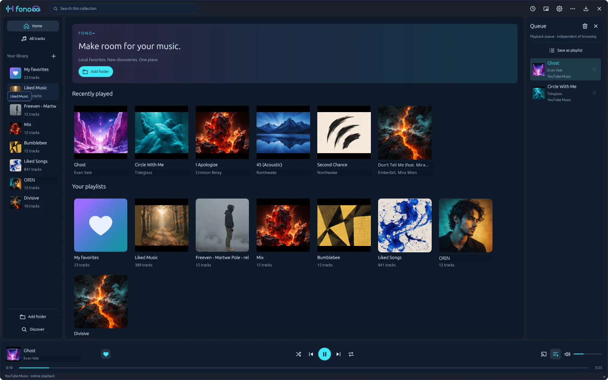
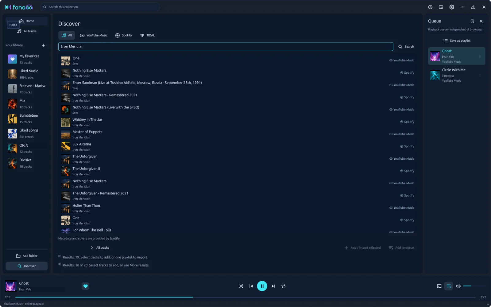
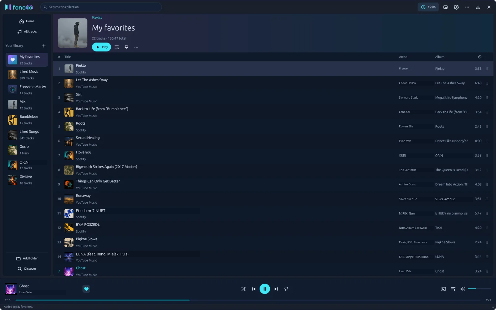
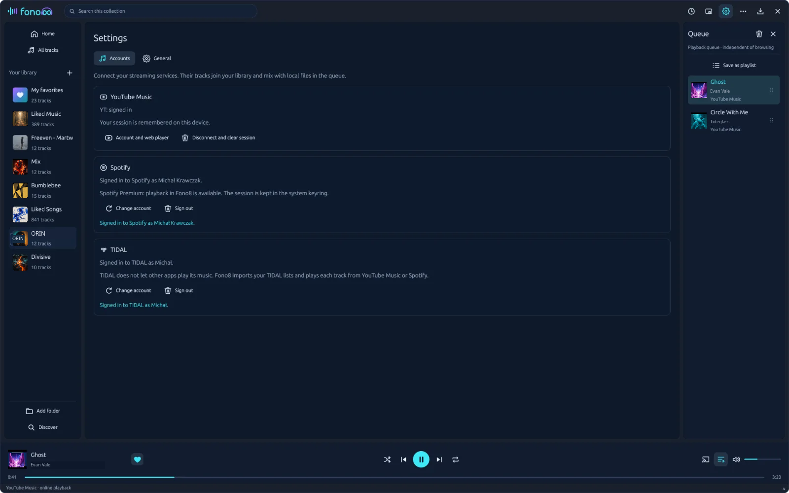

# Fono8

Your music. All together. [fono8.com](https://fono8.com)

**Fono8** is a desktop music player that brings music from your disk,
**YouTube Music** and **Spotify** into one library and one queue, and imports
your **TIDAL** lists into the same library. It runs on Linux and Windows (macOS
is on the way), feels fast thanks to a native Rust + GPUI interface, and sends
no data anywhere except to the services you sign in to.



### Highlights

- **One library, one queue** – local files (MP3, FLAC, WAV, OGG, M4A/AAC, AIFF),
  YouTube Music and Spotify tracks play one after another; every track shows
  where it comes from.
- **Discover** – one search field queries every connected service at once with
  the results mixed together; service tabs give access to your playlists, liked
  songs and imports from a link.
- **My favorites** – a special playlist with a heart on the player bar that
  cannot be deleted by accident.
- **Artists in one click** – click an artist to see all their tracks in your
  library, or to search for them in Discover.
- **Import from TIDAL** – favorites, albums and playlists from TIDAL become tracks
  matched on YouTube Music or Spotify (by ISRC), or TIDAL's 30-second previews.
- **Google Cast**, mini mode, sleep timer, system tray, keyboard shortcuts,
  English and Polish interface.







Streaming accounts are connected in **Settings → Accounts**. Spotify needs a
Premium account and the Client ID of your own app from the Spotify Developer
Dashboard; TIDAL needs a Client ID from the TIDAL developer portal (details
below). Sessions are kept in the system keyring.

## About the project

Fono8 is written in **Rust** with a **GPUI** interface (the UI framework of the
Zed editor): a navy, slightly translucent background with cyan and purple
accents, English and Polish texts, and the library in a local SQLite database.

Website: **[fono8.com](https://fono8.com)**. Project owner: **OPEN8**. Author:
**Michał Krawczak** (github@open8.co).

## Features

- **Local library**: background scanning of folders (with subfolders), a playlist
  named after each folder, rescanning, metadata from tags (ID3, Vorbis, FLAC, MP4,
  RIFF) via `lofty`, `Artist - Title` file names as a fallback, a review of
  `Artist - Album` folder metadata stored only in Fono8's database.
- **Playlists**: create, rename, delete, add selected tracks, remove from a
  playlist (Delete), move up/down, reorder by dragging the handle, M3U8 export,
  pinning to the home page.
- **Queue**: no duplicates, "Play" moves to the front,
  "Add to queue" appends what is missing), a panel on the right (a separate column
  from 1120 px, an overlay below), drag and drop, removing items, clearing, saving
  as a playlist.
- **Playback**: `rodio` + `symphonia` (MP3, FLAC, WAV, OGG Vorbis, M4A/AAC, AIFF),
  pause, previous/next, seeking, volume, mute, shuffle, repeat, history for
  "previous", skipping broken files without error loops.
- **Window**: a custom title bar (drag, double click to maximize), resizing from
  edges and the corner, a 440×210 mini mode, size and position remembered
  separately for full and mini mode, optional translucency, "Reset window layout".
- **Home**: pinned playlists, recently played, the playlist collection.
- **Covers**: `cover.jpg/png`, `folder.jpg/png`, `front.jpg` or the picture from
  the tags, decoded in the background and scaled to 320 px; a vinyl placeholder
  when none exists.
- **Sleep timer** (15/30/60/90 min or hours and minutes), **system tray**
  (StatusNotifierItem over D-Bus, an animated logo while playing, a Show /
  Play-pause / Previous / Next / Quit menu), **English/Polish/auto language**,
  keyboard shortcuts, a single-instance lock per data directory
  (`fono8.lock`).

## Google Cast

The **Cast** button next to the volume control (also in mini mode) lists the
devices on the local network. Pick e.g. **Google Nest Mini** to send Fono8's
audio there; **This computer** switches back to local output. The panel has its
own device volume slider and mute, which control the speaker directly; changes
made in Google Home are picked up live.

Audio is copied from Fono8's own decoding pipeline (`rodio`), encoded to 192 kb/s MP3 with the
built-in LAME and served by a local HTTP server at a random path, only on the
interface that leads to the device. It works the same on Linux, macOS and
Windows, without FFmpeg and without touching the system audio settings. While
casting, local output is muted and pausing sends silence to the speaker, so the
stream does not break. The Cast V2 protocol (mDNS, TLS on port 8009, protobuf
messages) is implemented in `src/cast/` without OpenSSL or `protoc`.

Limitations: the speaker's buffer delays pause, seeking and track
changes; the speaker shows the title "Fono8"; the computer has to stay on.
Stopping the session on the speaker, another app taking it over or a lost
connection switch back to local audio after a few seconds. Only tracks decoded
by Fono8 can be cast.

Live test: `cargo test discovers_and_streams -- --ignored --nocapture` finds the
first device on the network, connects, streams a few seconds of silence and
disconnects.

## YouTube Music (experimental)

The YouTube Music page is hosted by one of two engines driven by the same logic (crate `ytm-core/`):

- **Linux: an installed Chromium browser** (Google Chrome, Chromium, Brave or
  Edge, the first one found on `PATH`; `FONO8_BROWSER=/path` picks a specific
  one). Fono8 starts it with its own, isolated profile and drives it over the
  DevTools protocol on a pipe (`--remote-debugging-pipe`, no TCP port). This
  gives the full Google sign-in, including **USB security keys, passkeys and
  phone prompts**, which WebKitGTK does not support. The account window runs in
  app mode; the player is a hidden DevTools target without a window of its own
  (audio plays normally). Without such a browser Fono8 falls back to the helper
  below (no security keys); `FONO8_YTM_ENGINE=webkit|chromium` forces a choice.
- **macOS and Windows (and Linux without Chromium): the `fono8-web` helper
  process** (`wry` + `tao`): WKWebView on macOS, WebView2 on Windows, WebKitGTK
  on Linux. Fono8 talks to it over stdin/stdout (one JSON object per line).
  WKWebView and WebView2 support security keys natively.

**Signing in with the Chromium engine** takes two steps, because Google refuses
sign-in in a browser driven over DevTools ("This browser or app may not be
secure"). **Account and web player** closes the controlled session and opens a
plain, uncontrolled browser window on Fono8's profile, where you sign in as
usual (security keys included). Fono8 detects the end of the sign-in (a Google
session cookie appears in the profile; Fono8 only looks at cookie names, never
values), closes that window a few seconds later and starts the controlled
session again (minimized; Fono8 is the interface). You can also close the window
yourself or press **Signed in, back to Fono8**. A request sent before the account
page has loaded after the restart is retried automatically, with a progress bar
in the meantime. Fono8 does not work around Google's block, and Google may
revoke the session.

The engine starts only when you search YouTube Music in Discover or play an
online track. The `search` and `browse` API requests are made by the page
itself and only the JSON reply comes back to Fono8. Cookies, authorization
headers and stream URLs never leave the browser. Both engines block navigation
outside the list of Google/YouTube domains, downloads and new windows.

1. Open **Settings → Accounts → YouTube Music** and choose **Account and web
   player** to accept the consents and sign in, if you want your own playlists.
2. In **Discover**, search on the **All** or **YouTube Music** tab, select
   results (Ctrl/Shift) and add them to the library, a chosen playlist or the
   queue. On the **YouTube Music** tab paste a playlist link or ID and choose
   **Import copy**, or use **My playlists**.
3. Online tracks play in the helper's player; Fono8 controls them like local
   ones (pause, seeking, volume, mixed queue, end of track).

The session is kept in `ytmusic-profile/` next to the database (permissions
`0700`; for a snap Chromium in `~/snap/<browser>/common/`, because snaps cannot
see hidden directories); **Disconnect and clear session** stops the engine and
deletes the profile.

On Linux the helper needs the system `libwebkit2gtk-4.1` (part of every GNOME
desktop); building needs `libwebkit2gtk-4.1-dev` and `libgtk-3-dev` or the
`scripts/local-env.sh` script. Live tests: `cargo test helper -- --ignored
--nocapture` starts the helper and `cargo test chromium -- --ignored --nocapture`
the installed browser; both wait for the account state and run a search.

## Spotify

Spotify tracks play in Fono8 through the official **Web Playback SDK**, running
headless in an installed Google Chrome, Microsoft Edge or Brave (they ship
Widevine) driven over DevTools; `FONO8_BROWSER=/path` picks a specific one.
Requirements:

1. A **Spotify Premium** account.
2. Your own app in the [Spotify Developer Dashboard](https://developer.spotify.com/dashboard)
   with **Web API** and **Web Playback SDK** enabled and the Redirect URI
   `http://127.0.0.1:43821/callback`. In development mode an app serves up to 5
   accounts added under *User Management*.
3. In Fono8: **Settings → Accounts → Spotify**, enter the Client ID and sign in
   in the browser. **Change account** always shows the consent page ("Not you?").

While a Spotify track plays on Linux, the logo bars follow it by measuring the
player's audio stream in PipeWire (`pw-record`); the samples only feed the meter
and are never stored. Without PipeWire the logo shows a generic wave.

Search, your playlists (owned and collaborative – the only ones Spotify shares
with development-mode apps) and liked songs are in **Discover → Spotify**.
Covers come from Spotify's public oEmbed endpoint. Spotify tracks cannot be sent
through Fono8 Cast (DRM). Spotify playback does not work on Windows yet (no
DevTools pipe there).

## Import from TIDAL

TIDAL does not let third-party apps play full tracks, so Fono8 treats it as a
**source of lists**. You need your own app from the TIDAL developer portal with
the Redirect URI `http://127.0.0.1:43821/tidal/callback` and the scopes
`user.read collection.read playlists.read search.read`; enter its Client ID in
**Settings → Accounts → TIDAL**.

In **Discover → TIDAL** pick your favorite tracks, an album or a playlist, or
paste a link; the import mode decides how the tracks land in your library:

- **YouTube Music, then Spotify** – each track is searched by artist and title
  (with a duration check), and if it is missing, on Spotify by ISRC;
- **Spotify, then YouTube Music** – an exact match by ISRC first;
- **TIDAL – 30-second previews** – tracks stay TIDAL tracks and play the
  official preview (DRM-free, decoded by Fono8 and cached in `tidal-previews/`).

The result is an ordinary Fono8 playlist; tracks that could not be matched are
listed after the import.

## Not supported

- **Cast for YouTube Music** (coming soon) – in-process capture only covers
  files decoded by Fono8; online tracks play in the helper's browser and stay on
  this computer while casting. Fono8 says so in the status bar and the Cast
  panel.
- **Opus and WMA** – `symphonia` cannot decode them; the files are cataloged,
  playback reports an error and moves on.
- **Hiding to the tray on Wayland**: GPUI quits when the last window disappears,
  so "Hide" and closing the window **minimize** it instead. Music keeps playing.
  On X11 "Show Fono8" in the tray menu restores the window; on Wayland the
  compositor may refuse activation without a token – the window then comes back
  from the taskbar or Alt+Tab.
- Choosing folders and the M3U8 save location uses `xdg-desktop-portal` (it has
  to be installed, as on every modern desktop).

## Platforms

The code is shared between Linux, macOS and Windows; differences are behind `cfg`:

| | Linux | macOS | Windows |
| --- | --- | --- | --- |
| Graphics | Vulkan (blade) | Metal | DirectX |
| Audio | ALSA/PipeWire via `cpal` | CoreAudio | WASAPI |
| Tray | StatusNotifierItem (`ksni`, D-Bus) | menu bar (`tray-icon`) | notification area (`tray-icon`) |
| Title bar | custom (client-side decorations, dragging and edges in Fono8) | native buttons on a transparent bar | hidden native bar, Fono8 drag area |
| Hide | minimize | hide the app (like `Cmd+H`), the menu bar icon restores it | minimize |
| Data directory | `~/.local/share/fono8` | `~/Library/Application Support/fono8` | `%LOCALAPPDATA%\fono8` |
| Shortcuts | `Ctrl` | `Cmd` (`secondary` in gpui) | `Ctrl` |
| Package | AppImage and `tar.gz` with `.desktop` and icons | `Fono8.app` in a `.dmg` (ad-hoc signed, not notarized) | `zip` with `fono8.exe` (icon and version in the resources) |

The [Desktop builds](.github/workflows/build.yml) workflow builds and tests
Linux (AppImage and tar.gz) and Windows (ZIP) on pushes to `main`, in pull
requests and on demand; a `vX.Y.Z` tag creates a draft release
with the packages and SHA-256 checksums (details and the checklist in
[RELEASING.md](RELEASING.md)). macOS is disabled in the build matrix for now.
`scripts/package.sh <target> <name>` does the packaging. The macOS and Windows
builds have not been run outside CI yet: the first tests on real machines should
check window dragging, the tray and file dialogs.

## Building

Requirements: Rust 1.89+ (tested with 1.92). Linux: Vulkan (Mesa is enough),
PipeWire/PulseAudio/ALSA, `xdg-desktop-portal`. Development packages on
Ubuntu/Debian:

```bash
sudo apt install build-essential pkg-config libasound2-dev libfontconfig-dev \
  libfreetype-dev libxkbcommon-dev libxkbcommon-x11-dev libwayland-dev libvulkan-dev \
  libwebkit2gtk-4.1-dev libgtk-3-dev
cargo build --release
./target/release/fono8
```

Without administrator rights (no `-dev` packages) a script creates links to the
already installed libraries and a pkg-config stub in `target/local-sysroot`:

```bash
source scripts/local-env.sh && cargo build --release
```

On macOS the Xcode Command Line Tools are enough, on Windows the Visual Studio
Build Tools (MSVC); `cargo build --release` needs no extra packages.

The `xattr 0.2` dependency (via `gpui_http_client`) does not compile against a
recent `libc`, so `vendor/xattr` holds a patched copy wired in through
`[patch.crates-io]`.

## Running

**From a release (GitHub Releases):**

- Linux: download `Fono8-<version>-x86_64.AppImage`, make it executable
  (`chmod +x Fono8-*.AppImage`) and run it. On first start Fono8 adds itself to
  the application menu with its icon (`~/.local/share/applications/fono8.desktop`
  and `~/.local/share/icons/hicolor/`); the entry points to the AppImage, so after
  moving the file just run it once from its new place. An existing
  `fono8.desktop` that Fono8 did not create is left alone.
- Windows: extract the whole ZIP and run `Fono8\fono8.exe` (`fono8-web.exe` must
  stay next to it).

**From source:** `cargo run --release` (or `./target/release/fono8` after
`cargo build --release`; without `-dev` packages run `source scripts/local-env.sh`
first).

```bash
fono8                              # library in ${XDG_DATA_HOME:-~/.local/share}/fono8/
fono8 "/path/to/Music"             # scans the folder right away
fono8 --language pl|en|auto        # saves the language choice
fono8 --data-dir ./output/profile  # a different data directory
FONO8_DEBUG=1 fono8                # diagnostics on stderr (scanning, playback errors)
```

On start Fono8 moves the old `Sonora/Sonora/` directory (from before the rename)
to `fono8/` once; if `fono8/` already exists, both are left as they are and
`fono8/` is used.

## License

Fono8 is free software: you can redistribute it and/or modify it under the
terms of the **GNU General Public License, version 3 or (at your option) any
later version** – see [LICENSE](LICENSE). Copyright © 2026 OPEN8.

Every package also contains `THIRD_PARTY_NOTICES.md` with the licenses of the
bundled dependencies, generated with [cargo-about](https://github.com/EmbarkStudios/cargo-about)
(`cargo about generate about.hbs -o THIRD_PARTY_NOTICES.md`). Notable ones:
GPUI (Apache-2.0), Symphonia (MPL-2.0) and LAME, statically linked for Cast
(LGPL-3.0; you can rebuild and relink Fono8 from this source).

### Trademarks and third-party services

Spotify, YouTube, YouTube Music, TIDAL, Google Cast and Chromecast are
trademarks of their respective owners. Fono8 is an independent project and is
not affiliated with, sponsored by or endorsed by Spotify AB, Google LLC or
TIDAL. The names are used only to describe which services the player can
connect to.

Fono8 does not host, download or decrypt any music. Streaming services play in
your own browser with your own account and your own developer Client ID, so
your use of them is governed by their terms of service and developer policies,
not by this license. Those terms can change, a service may limit or revoke
access to automated clients, and features that depend on them may stop working.
Use the integrations at your own risk; the authors take no responsibility for
the state of your accounts.

Security reports: see [SECURITY.md](SECURITY.md).

## Shortcuts

| Shortcut | Action |
| --- | --- |
| Space | Play / pause, outside text fields |
| Ctrl+O (Cmd+O on macOS) | Add folder |
| Ctrl+N | New playlist |
| Ctrl+F | Search |
| Ctrl+← / Ctrl+→ | Previous / next |
| Ctrl+M | Mini / full mode |
| Ctrl+H | Hide (minimize; on macOS hide the app) |
| Ctrl+Q | Quit |
| Enter / Delete / ↑ ↓ / Shift+↑↓ / Ctrl+A | In the track list: play, remove from playlist, selection |
| Esc | Close a menu or dialog, cancel dragging |

Double click a track to play it, right click for its menu; Ctrl/Shift select
several. Double click a playlist in the library to put it at the front of the
queue and play it.

## Structure

| Path | Role |
| --- | --- |
| `src/library.rs` | SQLite, scanning, metadata |
| `src/playback.rs`, `src/audio.rs` | queue and audio engine on its own thread |
| `src/app.rs`, `src/app/tidal_import.rs` | application model, commands, menus, dialogs, Discover and Settings |
| `src/ui/main_view.rs` | main GPUI window |
| `src/ui/widgets.rs`, `src/ui/theme.rs` | buttons, covers, sliders, logo, palette and text sizes |
| `src/ui/text_input.rs` | text field (GPUI has none built in) |
| `src/services.rs`, `src/discover.rs` | shared account cards and the mixed Discover page |
| `src/oauth.rs`, `src/net.rs`, `src/keystore.rs`, `src/loopback.rs` | PKCE sign-in sessions, HTTPS limited to each service's hosts, keyring, the shared callback server |
| `src/spotify/` | Spotify Web API client and the Web Playback SDK engine |
| `src/tidal/`, `src/transfer.rs` | TIDAL API client, 30-second previews and matching for imports |
| `src/cast/` | Google Cast: mDNS discovery, Cast V2 protocol, MP3 relay |
| `ytm-core/` | shared YouTube Music session logic: API transport, account state, page player control |
| `src/youtube/`, `src/cdp.rs`, `fono8-web/` | models and paging, the DevTools pipe and Chromium engine, the `wry` helper process |
| `src/artwork.rs`, `src/tray/`, `src/sleep_timer.rs`, `src/i18n.rs`, `src/lock.rs`, `src/desktop.rs` | covers, tray (Linux and native), timer, translations, instance lock and data directory, Linux menu entry and icons |
| `build.rs`, `packaging/`, `scripts/` | Windows resources (icon, version), `.desktop`, `Info.plist`, packaging and AppImage tools |
| `locales/*.json`, `assets/icons/*.svg` | text catalogs and icons |

Tests: `cargo test` (library, metadata, translations, Cast protocol, MP3 relay
over HTTP, OAuth flows, Spotify and TIDAL parsers, matching rules);
`cargo test -- --ignored` additionally plays a WAV file on the real audio output,
connects to the first Cast device on the network and runs the live Spotify,
TIDAL and YouTube Music tests (they need accounts and the `FONO8_SPOTIFY_CLIENT_ID`
/ `FONO8_TIDAL_CLIENT_ID` variables).
